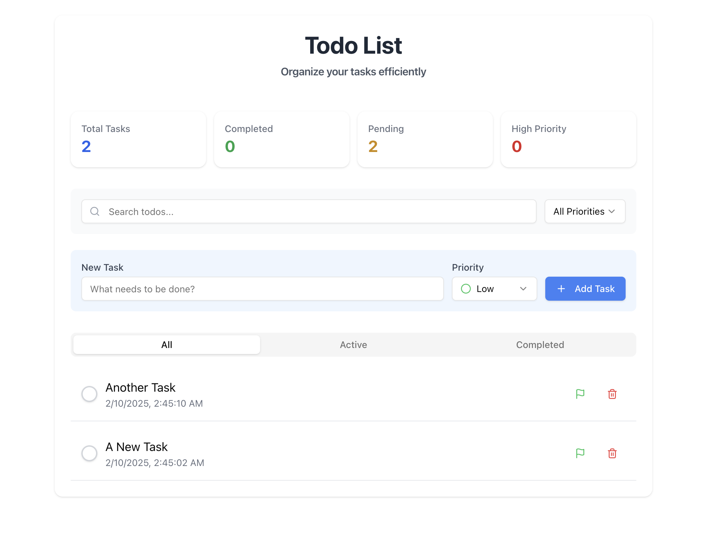

# Modern Todo List Application

A feature-rich todo list application built with Next.js, Redux Toolkit, and TypeScript. This application offers a clean, intuitive interface for managing daily tasks with advanced features like priority management, filtering, and real-time updates.



## Features

- ✨ Modern and responsive UI
- 📱 Mobile-first design
- 🎯 Priority-based task management
- 🔍 Real-time search functionality
- 🏷️ Filter tasks by status and priority
- 🎨 Beautiful animations with Framer Motion
- 💾 Persistent storage with localStorage
- 🔔 Toast notifications for actions
- 🌓 Clean and intuitive interface

## Tech Stack

- **Framework:** Next.js 15
- **State Management:** Redux Toolkit
- **Styling:** Tailwind CSS
- **UI Components:** Radix UI
- **Animations:** Framer Motion
- **Icons:** Lucide Icons
- **Notifications:** Sonner
- **Type Checking:** TypeScript

## Getting Started

1. Clone the repository:
```bash
git clone https://github.com/yourusername/todo-list.git
```

2. Install dependencies:
```bash
npm install
# or
yarn install
```

3. Run the development server:
```bash
npm run dev
# or
yarn dev
```

4. Open [http://localhost:3000](http://localhost:3000) with your browser to see the application.

## Usage

- **Add Task:** Enter task text, select priority, and click "Add Task"
- **Complete Task:** Click the checkbox to toggle completion
- **Change Priority:** Click the flag icon to cycle through priorities
- **Delete Task:** Click the trash icon to remove a task
- **Search:** Use the search bar to filter tasks
- **Filter:** Use priority filter or status tabs to organize tasks
- **View Stats:** See task statistics at the top of the page

## Project Structure

```
src/
├── components/
│   └── todo/
│       ├── AddTodoForm.tsx
│       ├── EmptyStates.tsx
│       ├── SearchFilters.tsx
│       ├── Statistics.tsx
│       ├── TodoItem.tsx
│       └── TodoList.tsx
├── store/
│   └── todoSlice.ts
├── types/
│   ├── todo.ts
│   └── todo-components.ts
└── hooks/
    └── redux-hooks.ts
```

## Key Features Explained

- **Priority Management:** Tasks can be set to Low, Medium, or High priority
- **Filtering System:** Filter tasks by status (All/Active/Completed) and priority
- **Search Functionality:** Real-time search across all tasks
- **Statistics:** Quick overview of total, completed, pending, and high-priority tasks
- **Responsive Design:** Optimized for all screen sizes
- **State Persistence:** Tasks are saved to localStorage
- **Empty States:** Helpful messages when no tasks match criteria
